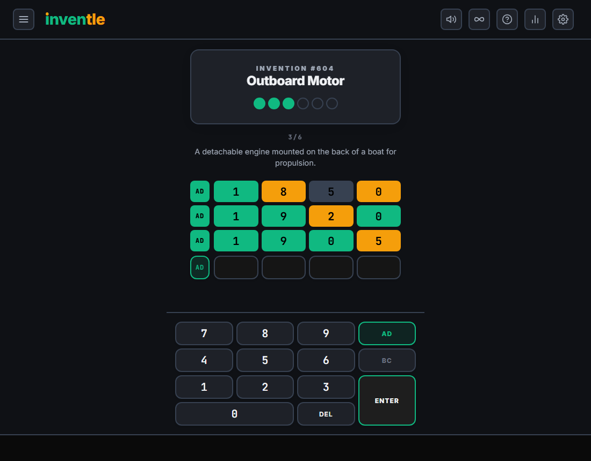
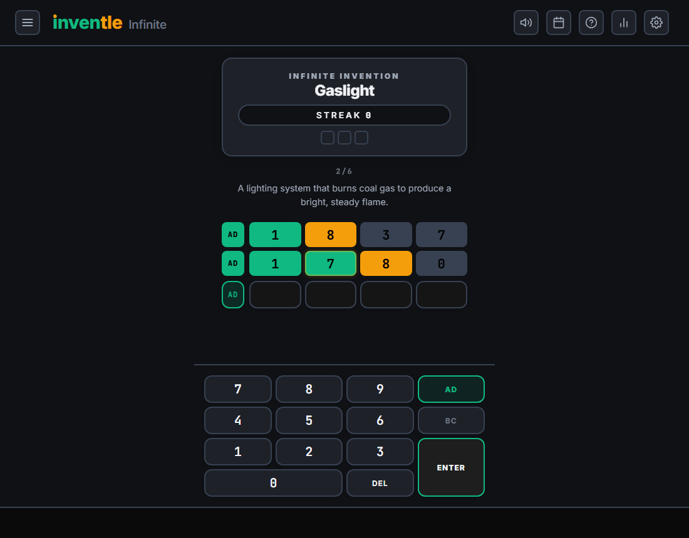
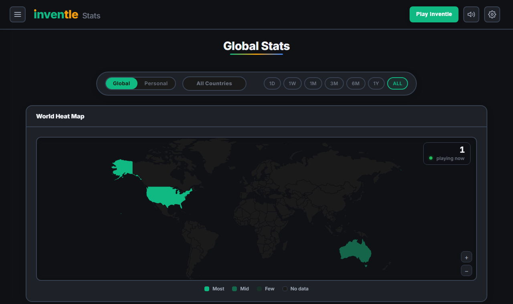
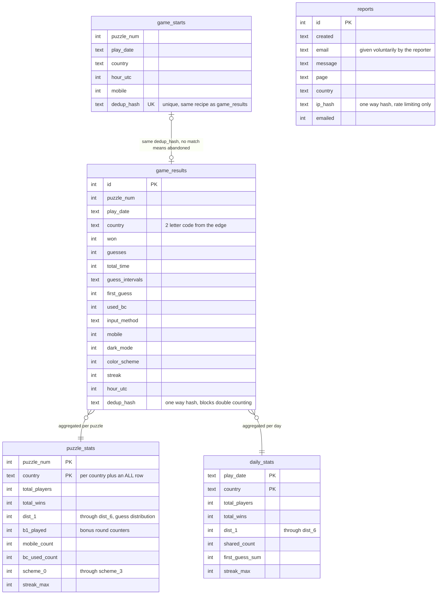
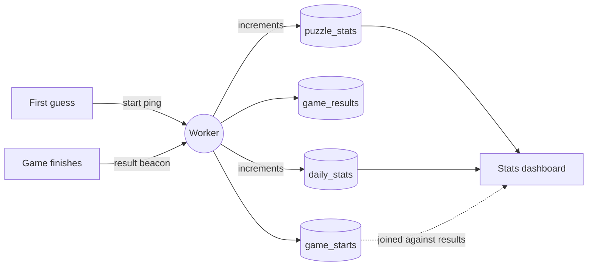
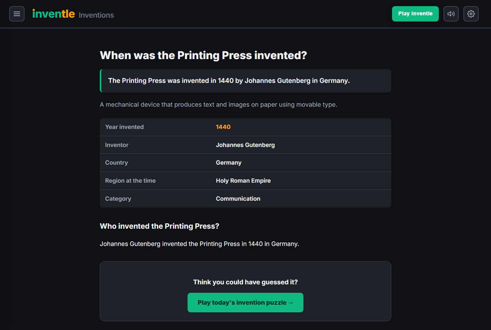

# Inventle

A daily invention guessing game. You get six tries to name the year a famous invention was created, with Wordle style feedback on every digit.

Live at **[inventle.io](https://inventle.io)**



## How it plays

Guess a four digit year. Every digit comes back colored.

| Color | Meaning |
| ----- | ------- |
| green | exact digit |
| amber | off by one |
| slate | off by two or more |

An AD/BC toggle covers years before the common era, so the answer space runs from 9999 BC to the present day. After the main puzzle, two bonus rounds ask for the country and the inventor, multiple choice, two attempts each.

Infinite mode drops the once a day limit and adds a run structure with strikes, shields, and a streak counter over the same 773 invention dataset.



## Architecture

No build step, no framework, no bundler. Plain HTML, CSS, and JavaScript served as static files from Cloudflare Pages, with a Cloudflare Worker and a D1 database behind the puzzle API and statistics.

```
index.html          daily puzzle
infinite.html       endless mode
stats.html          global statistics dashboard

js/core.js          shared game engine, rendering, settings
js/game.js          daily specific logic and persistence
js/infinite.js      run structure, strikes, shields, streaks
js/global-stats.js  statistics dashboard
js/sound.js         Web Audio effects
js/i18n.js          14 language string table
locales/            per language invention names and descriptions

worker/src/index.js Cloudflare Worker, puzzle API, guess grading, statistics
worker/*.sql        D1 schema and migrations

tools/generate-invention-pages.js
                    static page generator, one landing page per invention
```

### The answer lives on the server

The daily page never receives the answer. The daily data file ships invention names and descriptions but no years. The Worker holds the year and grades each guess, and only reveals the year once the game is over. Infinite mode is different, it needs the whole dataset locally, so its data file includes years.

Which invention appears on which day comes from a seeded permutation of the list, computed in the Worker. That permutation is redacted in this repository, publishing it would hand over every future answer. See `serverShuffle` in `worker/src/index.js` and supply your own seed to run it.

## How we date an invention

Every entry carries one canonical year, chosen from patent records, first working prototypes, and first public demonstrations. That single number is a simplification, and the grading system is honest about it in three ways.

### 1. Range answers for disputed dates

82 of the 773 inventions accept any year inside a range as a full win, all four tiles turn green. The ranges fall into three tiers.

**Genuinely uncertain ancient dates.** Nobody knows when fish farming began. The game accepts anything from 8000 BC to 2000 BC. The battering ram accepts 2500 BC to 900 BC.

**Development spans.** Some inventions did not happen in a year. The zipper accepts 1893 to 1917, covering Judson's first clasp locker through Sundback's modern design. The photocopier accepts 1938 to 1959, Carlson's first electrophotograph through the first commercial Xerox machine. Velcro accepts 1941 to 1955, the burr walk through the patent.

**Sources disagree, both defensible.** The computer accepts 1945 and 1946, ENIAC was completed in late 1945 and dedicated in February 1946. Monopoly accepts 1935 and 1936, patented then commercially sold. Pepsi accepts 1893 to 1898, it was Brad's Drink for its first five years.

The full list lives in `YEAR_RANGES` in the Worker, with the client mirror in `js/data-overlay.js` for infinite mode.

### 2. The compromises

**One year per invention everywhere else.** "Invented" can mean conceived, patented, prototyped, or sold, and sources pick different moments. Where the choice was contested we either picked the most commonly cited year or promoted the entry into a range. The remaining 691 single year answers are the most defensible date, not the only defensible date.

**Digit feedback is per digit, not per distance.** Guessing 1899 against an answer of 1900 shows green, amber, slate, slate, even though the guess is only one year off. The two nines read as far from the two zeros because each tile compares its own digit, an amber tile means that digit is off by one, not that the year is close. This is the trade that makes the game a digit puzzle rather than a hotter or colder guessing game. The AD/BC era is graded first, a guess in the wrong era shows four slate tiles no matter how close the digits are.

**Ancient dates are approximations.** Anything BC is scholarship, not record keeping. Those entries either carry wide ranges or a conventional round number.

### 3. Exceptions

There is no year zero. The input rejects it. Years run 1 BC directly to 1 AD.

## Inventors, multiple inventors, and unknown inventors

The second bonus round asks who invented it. The data stores one primary inventor per entry, and three mechanisms keep the grading fair.

**Alternative inventors are also correct.** History rarely has one parent per idea. An overlay table credits disputed and co inventors as correct answers. For the telephone, Alexander Graham Bell is the stored answer, and Elisha Gray and Antonio Meucci are also accepted. For radio, Marconi is stored, and Tesla and Oliver Lodge are accepted. Ethernet accepts Metcalfe plus Boggs, Lampson, and Thacker.

**Name matching is forgiving.** A full name, a last name alone, or a known alias all match. Alias tables cover people and groups, so "Sumerians" and "Ancient Sumerians" grade the same.

**Group credits are real credits.** About 70 entries credit a civilization, company, or lab rather than a person. Cuneiform writing credits the Sumerians, satellite communication credits Bell Labs, the compact disc credits Philips and Sony jointly. Multiple choice options for these entries are drawn from plausible groups of the same era and region.

**When nobody knows.** Nine inventions, including the wheelchair, the cannon, and the musket, have no identifiable inventor. For those the bonus round replaces itself with a free point and says so on the card, nobody actually knows who invented this.

The multiple choice options are generated with a seeded shuffle keyed to the puzzle number, so every player worldwide sees the same choices in the same order on the same day.

## Statistics, and what we collect



### The principles

No accounts, no fingerprinting, no IP storage, and the game itself sets no cookies. Your personal play history, streaks, and preferences live in your own browser's localStorage and never leave your device. The Personal tab of the stats page reads that local data in place.

The live site shows ads from a third party network, isolated in iframes. Whatever that network does happens inside its frame and is governed by its own policies, none of the game's telemetry is shared with it.

The global numbers come from anonymous, aggregate telemetry. The full privacy notes live in `worker/SETUP.md`, and the short version is below.

### What a finished game sends

One beacon at the end of a completed game, containing only gameplay facts.

| Field | Example | Why |
| ----- | ------- | --- |
| puzzle number, date | 604 | which puzzle this was |
| won, guess count | won in 4 | win rate, guess distribution |
| solve time, guess intervals | 61s | pacing charts |
| first guess year | 1900 | opening strategy chart |
| BC toggle used | no | how often eras come up |
| input method, device type | numpad, mobile | UX decisions |
| dark mode, color scheme | dark, default | theme usage |
| current streak | 3 | streak charts |
| hour, UTC | 14 | play time heatmap |

A second tiny ping fires on the first guess of a game. Joining starts against finishes is what makes the abandoned games statistic an exact count rather than an estimate.

### What we deliberately do not have

**No IP addresses.** Country comes from Cloudflare's edge geolocation, which resolves at the network level before the request reaches Worker code. The Worker sees a two letter country code, never the address itself.

**No identity.** A one way SHA-256 dedup hash prevents the same finished game being counted twice on a reload. It is derived from a random per puzzle session id, not from anything about the person, and cannot be reversed into anyone.

**No raw browsing data.** The database stores game rows and aggregate counters. There is nothing to sell and nothing to leak.

The one exception is voluntary, the problem report form on invention pages asks for an email address so we can reply, and rate limits by a one way hash of the IP that is used for counting and nothing else.

### Database shape

Individual game rows land in `game_results`, and two aggregate tables are incremented on every write so the dashboard never scans raw rows. Start pings land in `game_starts` and join against results by dedup hash.



The write path, end to end.



Every aggregate row exists twice, once per country and once under the country code ALL, so the dashboard can filter by country without scanning game rows.

## Invention landing pages



`tools/generate-invention-pages.js` reads `inventions.json` and emits a landing page per invention plus an index and a sitemap. The page chrome is extracted from `about.html` at build time, so a header change on the main site is inherited on the next run instead of drifting.

## Running locally

```bash
python -m http.server 8000
# open http://localhost:8000
```

The static site works on its own. Anything server backed, the daily answer, guess grading, and global statistics, needs the Worker.

```bash
cd worker
npx wrangler dev
```

`worker/SETUP.md` walks through creating the D1 database and loading the invention data. `worker/wrangler.toml` ships with placeholder resource IDs, replace them with your own.

## Sound credits

Most sound effects come from [Pixabay](https://pixabay.com) under the [Pixabay Content License](https://pixabay.com/service/license-summary/), which allows free use without attribution. We credit the creators anyway, they earned it. The rest, the digit spin, the digit landing, the era flip, and both win glows, are synthesized at runtime with the Web Audio API and use no recordings at all.

| Sound in game | Effect | Creator |
| ------------- | ------ | ------- |
| Number key click | [Single Key Press](https://pixabay.com/sound-effects/single-key-press-393908/) | [DRAGON-STUDIO](https://pixabay.com/users/dragon-studio-38165424/) |
| Delete key | [keyboard typing one short 1](https://pixabay.com/sound-effects/keyboard-typing-one-short-1-292590/) | [NCPRIME](https://pixabay.com/users/ncprime-45698203/) |
| Puzzle solved | [Success](https://pixabay.com/sound-effects/success-48018/) | [freesound_community](https://pixabay.com/users/freesound_community-46691455/), original by [Kagateni](https://freesound.org/people/Kagateni/) |
| Puzzle failed | [Wrong Answer](https://pixabay.com/sound-effects/wrong-answer-129254/) | [Universfield](https://pixabay.com/users/universfield-28281460/) |
| Bonus answer correct | [Success Notification](https://pixabay.com/sound-effects/success-notification-132473/) | [Universfield](https://pixabay.com/users/universfield-28281460/) |
| Bonus answer wrong | [Error Notification 08](https://pixabay.com/sound-effects/error-notification-08-206492/) | [Universfield](https://pixabay.com/users/universfield-28281460/) |
| Strike taken | [Hammer Steel Impact](https://pixabay.com/sound-effects/hammer-steel-impact-454390/) | [Universfield](https://pixabay.com/users/universfield-28281460/) |
| Shield earned | [Metal Hit](https://pixabay.com/sound-effects/metal-hit-153323/) | [Universfield](https://pixabay.com/users/universfield-28281460/) |
| Shield used | [Metal Punch](https://pixabay.com/sound-effects/metal-punch-142334/) | [Universfield](https://pixabay.com/users/universfield-28281460/) |

The enter key press is a separately sourced recording. The audio files themselves are not in this repository, the license covers use on the site but not redistribution of the files. When a file is absent, `js/sound.js` falls back to a small synthesized tick for the key sounds and stays silent for the rest.

## Data

`inventions.json` holds 773 entries, name, year, country, inventor, category, and a short description. `inventions.schema.md` documents the shape. The dataset is compiled from public sources and cross checked against patent records and encyclopedia entries.

## License

MIT, see [LICENSE](LICENSE). The invention dataset is compiled from public sources. The Inventle name and logo are not covered by the license.
